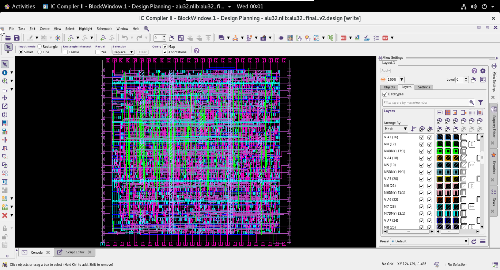
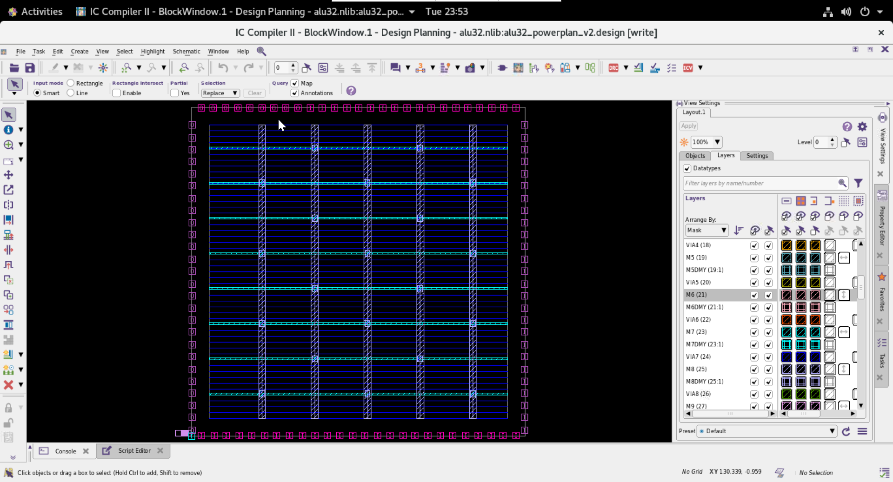

# 32-bit ALU — RTL-to-GDSII Physical Design (SAED32, 32nm)

A complete RTL-to-GDSII implementation of a registered 32-bit ALU on the
Synopsys SAED32 educational PDK, taken from Verilog RTL through synthesis,
place-and-route, clock tree synthesis, and routing to a **DRC-clean routed
layout with GDSII export**.

Built with the industry-standard Synopsys flow: **Design Compiler → IC Compiler II**.

---

## Highlights

- **625 MHz** timing closure (1.60 ns clock) with **+0.29 ns setup slack**
- **10 ps global clock skew** across 103 sequential elements
- **Zero DRC violations** — routing and power-grid clean
- **Zero setup/hold violations**
- Multi-Vt synthesis (RVT / HVT / LVT) for timing-vs-leakage optimization
- Custom power-grid recipe tuned for the block, diagnosed and fixed from an
  initial 40-violation grid down to a fully clean one

---

## The Design

A 32-bit ALU with **registered inputs and outputs** (not purely combinational),
so every operation is a true flip-flop-to-flip-flop timing path — giving a
meaningful clock tree and honest timing numbers.

**Supported operations (10):** ADD, SUB, AND, OR, XOR, NOR, SLT (signed),
SLL, SRL, SRA — plus zero, carry, and overflow status flags.

The RTL registers operands on input, computes combinationally, and registers
the result on output — a 3-stage structure that exercises real reg-to-reg
paths through the ALU logic.

---

## Results

## Layout


*Fully routed design — DRC-clean at 625 MHz*


*Tuned M7/M8 power mesh with M1 standard-cell rails*

### Timing (post-route)

| Path Group | Levels of Logic | Path Length | Slack | Status |
|---|---|---|---|---|
| register → register | 19 | 1.18 ns | +0.29 ns | met |
| input → register | 1 | 0.37 ns | +1.07 ns | met |
| register → output | 0 | 0.12 ns | +1.06 ns | met |

- Clock period: **1.60 ns (625 MHz)**
- Setup WNS / TNS: **0.00 / 0.00** (0 violating paths)
- Hold WNS / TNS: **0.00 / 0.00** (0 violating paths)

### Clock Tree

| Metric | Value |
|---|---|
| Sinks (flip-flops) | 103 |
| Global skew | **10 ps** |
| Max latency | 10 ps |
| Tree levels | 1 |
| Clock DRCs | 0 |

### Physical

| Metric | Value |
|---|---|
| Standard cells | 1,815 functional + ~3,900 fillers |
| Core area | 7,090 µm² |
| Cell area | 4,469 µm² |
| Utilization | 63% |
| Routing congestion | 0.13% overflow |
| Routing DRCs | **0** |
| PG DRCs | **0** |

---

## Flow

```
Verilog RTL
   │  (functional verification — testbench, all 10 ops pass)
   ▼
Synthesis  ── Design Compiler (compile_ultra, multi-Vt SAED32)
   │  → gate-level netlist, SDC, timing/area/power reports
   ▼
Place & Route  ── IC Compiler II
   ├─ Floorplan        (70% util, pin placement)
   ├─ Power Planning   (M7/M8 mesh + M1 rails, custom recipe)
   ├─ Placement        (place_opt, legalized)
   ├─ Clock Tree Synth (clock_opt → 10 ps skew)
   ├─ Routing          (route_auto + route_opt → 0 DRCs)
   └─ Chip Finishing   (SHFILL filler insertion)
   │  → routed netlist, SPEF, SDF, GDSII
   ▼
Signoff STA  ── PrimeTime  (planned follow-up)
```

---

## Repository Structure

```
.
├── rtl/              alu32.v            — the design
├── tb/               alu32_tb.v         — self-checking testbench
├── constraints/      alu32.sdc          — timing constraints
├── scripts/
│   ├── dc.tcl                           — Design Compiler synthesis
│   ├── icc2.tcl                         — IC Compiler II PnR
│   └── pt.tcl                           — PrimeTime signoff (STA)
├── reports/                             — QoR, timing, area, DRC reports
├── screenshots/                         — floorplan, PG, placement, routing
└── gds/              alu32.gds.gz       — final routed layout
```

---

## Key Engineering Notes

**Why registered I/O?** A purely combinational ALU has no clock — no CTS, no
reg-to-reg paths, no meaningful timing story. Registering I/O makes every
operation a real timing path and produces genuine skew and slack numbers.

**Power-grid tuning.** The initial power grid (adapted from a reference RISC
core flow) used aggressive strap dimensions sized for a much larger die. On
this small block it crowded the router and produced 40 DRC violations.
Diagnosing this as a PG-geometry issue, the grid was re-tuned (thinner straps,
wider pitch, dropped redundant mid-layer mesh), which dropped routing
congestion from 0.41% to 0.13% and cleared all 40 violations.

**Multi-Vt.** Synthesis targeted RVT, HVT, and LVT libraries so the tool could
trade speed against leakage. At the closed 1.6 ns period the mapping is
HVT-dominated with LVT on the tighter paths.

**PDK note.** SAED32's standard cells include intrinsic well-taps, so no
explicit tap-cell insertion was required (confirmed by clean legality checks).

---

## Tools & Environment

- **Synthesis:** Synopsys Design Compiler (V-2023.12-SP2)
- **Place & Route:** Synopsys IC Compiler II (S-2021.06-SP2)
- **Signoff STA:** Synopsys PrimeTime (planned)
- **PDK:** SAED32 32/28nm educational kit, NLDM libraries, ss corner (0.75V, 125°C)
- **Simulation:** Icarus Verilog (functional verification)

---

## Reproducing

The scripts assume access to the SAED32 PDK and Synopsys tools. Adjust the
library paths at the top of `scripts/dc.tcl` and `scripts/icc2.tcl` to your
environment, then:

```bash
# 1. Functional verification
iverilog -o sim.vvp rtl/alu32.v tb/alu32_tb.v && vvp sim.vvp

# 2. Synthesis
dc_shell -f scripts/dc.tcl

# 3. Place & route (run interactively, stage by stage)
icc2_shell
  source scripts/icc2.tcl
```

---

## Status

- [x] RTL design & functional verification
- [x] Synthesis (625 MHz, multi-Vt)
- [x] Floorplan & power planning
- [x] Placement
- [x] Clock tree synthesis (10 ps skew)
- [x] Routing (0 DRCs)
- [x] Chip finishing & GDSII export
- [ ] PrimeTime signoff STA (planned)

---

*A block-level physical design project demonstrating a complete RTL-to-GDSII
flow on an industrial EDA toolchain and educational PDK.*
